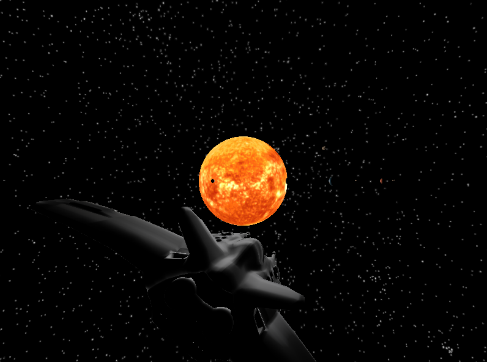
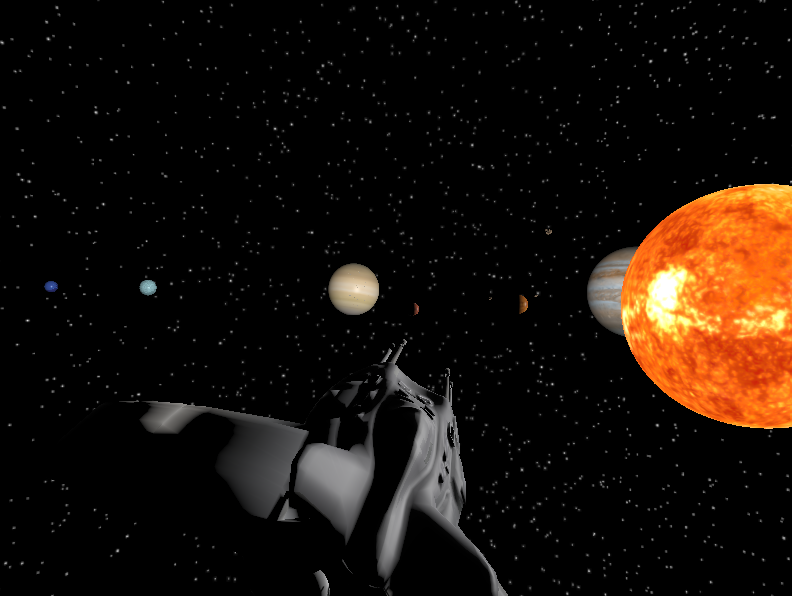

# INF01047 - Fundamentos de Computação Gráfica (FCG) - Trabalho Final
Repositório para o Trabalho Final da disciplina de Fundamentos de Computação Gráfica.

Alunos: 

Laís Fernanda Canabarro Araujo

Leonardo Dalpian Dutra

Ideia inical: Planejamos desenvolver uma aplicação gráfica interativa de exploração espacial pelo Sistema Solar. A proposta consiste em criar modelos realistas para os planetas, luas e outros corpos celestes, permitindo aos usuários explorar o espaço de forma intuitiva. 

---

### Contribuição de cada membro da dupla para o trabalho:

Laís implementou os seguintes requisitos:

  - Implementação dos objetos complexos da cena virtual: spaceship, rock, asteroid;
  - Mapeamento de texturas de Marte, Jupiter, Saturno, Urano, Netuno, Nave, Rocha e Asteroide;
  - Transformações geométrica controladas pelo usuário: movimentação da cena pelo teclado;
  - Animações baseadas no tempo: translação e rotação dos planetas e movimentação da nave junto com a câmera;
  - Movimentação com curva Bézier cúbica para os objeto "Asteroid" e "Spaceship".

Leonardo implementou os seguintes requisitos:

  - Renderização dos objetos;
  - Modelos de iluminação de objetos geométricos;
  - Implementação das esferas e escalas utilizadas;
  - Mapeamento da textura do Sol, Mercúrio, Venus e Terra;
  - Movimentação cima/baixo;
  - Skybox;

### Uso do ChatGPT: 
Foi utlizado para auxílio em questões pontuais do código e como base para o desenvolvimento da função da curva de Bezier.

 para desenvolvimento do trabalho, descrevendo como a ferramenta foi utilizada e para quais partes do trabalho. O parágrafo deve também incluir uma análise crítica descrevendo quão útil a dupla achou a ferramenta, onde ela auxiliou e onde ela não auxiliou adequadamente;

- Pontos em que o ChatGPT ajudou:
  - Implementação da curva de Bézier;
  - Ajustes na animação dos planetas.

- Exemplo do que o ChatGPT não conseguiu ajudar:
  - Não conseguiu ajudar na implementação da Skybox de forma coerente com o projeto;
  - Não ajudou no controle da nave, que se movimenta junto com a movimentação do mouse.

### Descrição do processo de desenvolvimento e do uso dos conceitos de Computação Gráfica:
O trabalho começou seu desenvolvimento a partir do código fonte do Laboratório 4. Além disso, o Laboratório 5 também serviu de auxílio para o mapeamento de texturas e do Laboratório 2 foi utilizado para implementar a movimentação da câmera a partir do teclado.

Em  geral, os passos desenvolvidos, em sequência, foram:
  - criação do cenário (com Sol e Mercúrio);
  - movimentação da câmera com o teclado;
  - animações dos planetas;
  - implementação do restante dos planetas;
  - implementação da Skybox;
  - implementação de novos objetos;
  - curva de Bezier.

### Funcionamento da aplicação:
Imagem inicial da aplicação:

Visualização do restante dos planetas:

    
### Manual:
- Teclado:
  - Teclas W, A, S, D: movimentação da câmera para frente (W), esquerda (A), trás (S), direita (D);
  - Teclas "ESPAÇO" e Shift: movimentação da câmera para cima ("ESPAÇO") e para baixo (Shift);

- Mouse:
  -  Botão esquerdo: movimentação da câmera;

### Passo a passo para execução do programa:
- Abra o arquivo Laboratorio_5.cbp no diretório "INF01047-FCG-Trabalho-Final" com o programa CodeBlocks;
- Compile e execute o código em Build > Build and Run;
  
  
